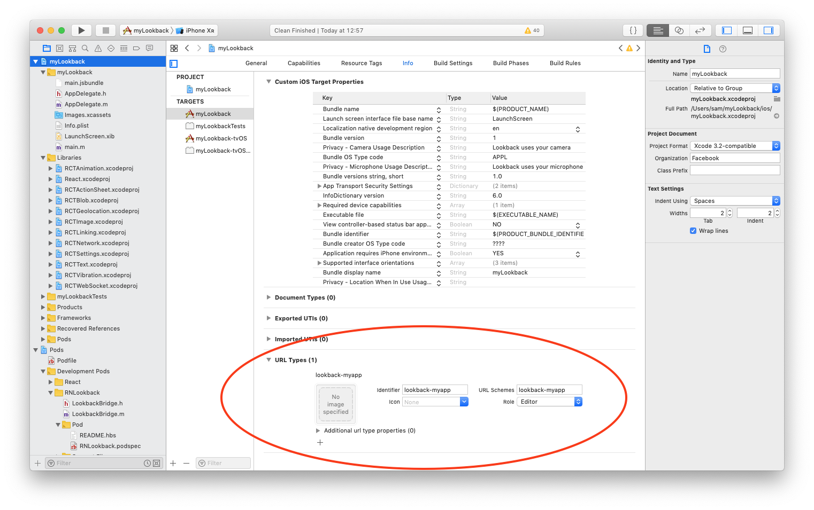
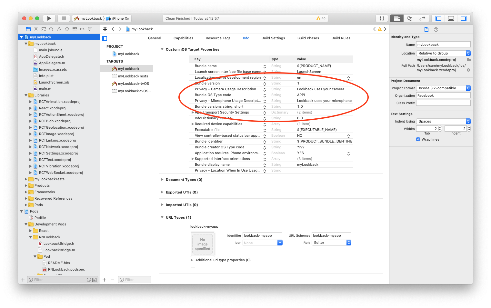

# react-native-lookback

## What is this?

This package allows you to use the [Lookback](https://lookback.io) user testing utilities in your *React Native* projects.
Using Lookback will let you live stream your app to observers as users interact with it, record sessions and upload them for later viewing, 
and moderate and engage with your users while they're testing your app.

## Platforms

The Lookback SDK is only supported on iOS.

## Installation

Download React Native Lookback in your React Native project from GitHub using:

    npm install git+ssh://git@github.com/spotify/react-native-lookback --save

### Mostly automatic installation

#### _Requires [Cocoapods](https://cocoapods.org/)_

1. Setup CocoaPods. If you **don't** have a Podfile for your app already, in your project folder run:

   ```
   cd ios && pod init
   ```

2. Add the CocoaPod specs
   
   - In your App's `Podfile` add the **React Native Lookback** podspec
        ```ruby
        pod 'RNLookback', :path => '../node_modules/react-native-lookback/RNLookback.podspec'
        ```
   - Add the subspec for **React** and it's dependencies in your `Podfile` to the locally installed CocoaPods, as the normal [React CocoaPod](https://cocoapods.org/pods/react) is out of date.
       ```ruby
       pod 'DoubleConversion', :podspec => '../node_modules/react-native/third-party-podspecs/DoubleConversion.podspec'
       pod 'glog', :podspec => '../node_modules/react-native/third-party-podspecs/glog.podspec'
       pod 'Folly', :podspec => '../node_modules/react-native/third-party-podspecs/Folly.podspec'
       pod 'yoga', :path => '../node_modules/react-native/ReactCommon/yoga'
       pod 'React', :path => '../node_modules/react-native',
          :subspecs => [
              'Core',
              'CxxBridge'
          ]
       ```
1. In your iOS folder run 
   ```
   pod install
   ```
1. Open your newly created _`Project`_`.xcworkspace` (**not** your existing _`Project`_`.xcodeproj`)
2. Run your project (`Cmd+R`)

## Configuration

To use Lookback Participate (recommended), you need to set up your app to handle links from Lookback.

1. Go to lookback.io and get your project's App Prefix. It will be something like:

        'lookback-appname'
    
    It's generated for you when you register a new app for testing.

2. Add your App Prefix to your App's URL Types [following Apple's documentation for adding a custom url scheme.](https://developer.apple.com/documentation/uikit/core_app/allowing_apps_and_websites_to_link_to_your_content/defining_a_custom_url_scheme_for_your_app?language=objc)
    
4. Set the Privacy keys in your Info.plist file for Microphone and Camera access for your app.

    
    Apps that don't use the camera or microphone can use these descriptions which are [specific to Lookback](https://help.lookback.io/installing-the-ios-sdk/configuring-lookback/configuring-lookback-participate):

    - NSCameraUsageDescription: Lookback uses the camera to record you during user research studies
    - NSMicrophoneUsageDescription: Lookback uses the microphone to record you during user research studies

3. Ensure that you have React Native [linking setup](https://facebook.github.io/react-native/docs/linking) so that your React Native App can handle incoming links. 


   In AppDelegate.m you should have:

   ```obj-c
    #import <React/RCTLinkingManager.h>

    @implementation

    // The rest of your App Delegate here...

    /**
    Allow React Native to respond to links that target this app.
    */
      - (BOOL)application:(UIApplication *)application
         openURL:(NSURL *)url
         options:(NSDictionary<UIApplicationOpenURLOptionsKey,id> *)options
      {
        return [RCTLinkingManager application:application openURL:url options:options];
      }

    @end
   ```

   Once this is in place `react-native-lookback` will be able to intercept Participate links.
## Usage

### Lookback Participate

Register your URL Scheme with Lookback Participate to allow Lookback to respond to Participate urls. For more info, [see Lookback Participate features](https://lookback.io/features/) such as Live sessions and Self-Testing sessions.

```javascript
import Lookback from 'react-native-lookback';
// Tell Lookback what your url scheme is
Lookback.setupParticipate('myproject-lookback');
```
That's it! Now your App is ready to join live sessions or run self-test sessions.

* * *

### Lookback Recorder

If you want to programatically control Lookback, you must configure Lookback with your app token instead of using Participate. Your app token is found in your Organization settings on your lookback.io dashboard.

```javascript
import Lookback from 'react-native-lookback'

// Initialise Lookback
Lookback.setupWithAppToken('myapptoken');
/**
 * Some possible uses:
 */
// Turn on shake to record
Lookback.shakeToRecord = true;
// Or show the Lookback feedback bubble
Lookback.feedbackVisible = true;
// Or show the Lookback recorder view
Lookback.recorderVisible = true;
```

### Lookback Recorder API
<a name="module_Lookback"></a>

## Lookback
A module for controlling Lookback from React Native


* [Lookback](#module_Lookback)
    * _static_
        * [.onStartedUpload](#module_Lookback.onStartedUpload) : <code>Callback</code>
        * [.onSettingsUpdate](#module_Lookback.onSettingsUpdate) : <code>Callback</code>
        * [.settings](#module_Lookback.settings) : <code>Object</code>
        * [.recording](#module_Lookback.recording) : <code>Boolean</code>
        * [.paused](#module_Lookback.paused) : <code>Boolean</code>
        * [.showIntroductionDialogs](#module_Lookback.showIntroductionDialogs) : <code>Boolean</code>
        * [.recorderVisible](#module_Lookback.recorderVisible) : <code>Boolean</code>
        * [.feedbackBubbleVisible](#module_Lookback.feedbackBubbleVisible) : <code>Boolean</code>
        * [.shakeToRecord](#module_Lookback.shakeToRecord) : <code>Boolean</code>
        * [.setupParticipate(urlScheme)](#module_Lookback.setupParticipate)
        * [.setupWithAppToken(token)](#module_Lookback.setupWithAppToken)
    * _inner_
        * [~uploadCallback](#module_Lookback..uploadCallback) : <code>function</code>
        * [~settingsCallback](#module_Lookback..settingsCallback) : <code>function</code>

<a name="module_Lookback.onStartedUpload"></a>

### Lookback.onStartedUpload : <code>Callback</code>
Set a callback to fire when Lookback starts uploading a recording
This only applies if you are starting the recording yourself
rather than the user clicking the feedback bubble

**Kind**: static property of [<code>Lookback</code>](#module_Lookback)  
**Use**: Lookback.onStartedUpload = (upload) => console.log(upload.destinationURL, upload.sessionStartedAt);  
<a name="module_Lookback.onSettingsUpdate"></a>

### Lookback.onSettingsUpdate : <code>Callback</code>
Set a handler to listen for updates to settings from Lookback

**Kind**: static property of [<code>Lookback</code>](#module_Lookback)  
**Use**: Lookback.onSettingsUpdate = (setting) => console.log(setting);  
<a name="module_Lookback.settings"></a>

### Lookback.settings : <code>Object</code>
The current settings Lookback is using.
These are set asynchronously, so may not be accurate all the time.
If you want to observe settings, register a callback for @see [onSettingsUpdate](onSettingsUpdate)

**Kind**: static property of [<code>Lookback</code>](#module_Lookback)  
**Read only**: true  
<a name="module_Lookback.recording"></a>

### Lookback.recording : <code>Boolean</code>
Set Lookback Recorder to start recording with the default options or to stop recording the current session

**Kind**: static property of [<code>Lookback</code>](#module_Lookback)  
<a name="module_Lookback.paused"></a>

### Lookback.paused : <code>Boolean</code>
Pause or Resume the recording

**Kind**: static property of [<code>Lookback</code>](#module_Lookback)  
<a name="module_Lookback.showIntroductionDialogs"></a>

### Lookback.showIntroductionDialogs : <code>Boolean</code>
Whether to show the introduction dialogs for Lookback

**Kind**: static property of [<code>Lookback</code>](#module_Lookback)  
<a name="module_Lookback.recorderVisible"></a>

### Lookback.recorderVisible : <code>Boolean</code>
Show or hide the Lookback Recorder UI, the equivalent to pressing the feedback bubble in app

**Kind**: static property of [<code>Lookback</code>](#module_Lookback)  
<a name="module_Lookback.feedbackBubbleVisible"></a>

### Lookback.feedbackBubbleVisible : <code>Boolean</code>
Show or Hide the feedback bubble

**Kind**: static property of [<code>Lookback</code>](#module_Lookback)  
<a name="module_Lookback.shakeToRecord"></a>

### Lookback.shakeToRecord : <code>Boolean</code>
Shake Device to Record

**Kind**: static property of [<code>Lookback</code>](#module_Lookback)  
<a name="module_Lookback.setupParticipate"></a>

### Lookback.setupParticipate(urlScheme)
Set up Lookback to use Lookback Participate

**Kind**: static method of [<code>Lookback</code>](#module_Lookback)  
**See**: [Lookback.io](https://lookback.io)  

| Param | Type | Description |
| --- | --- | --- |
| urlScheme | <code>String</code> | URL scheme specified in Lookback dashboard and in your Info.plist, usually in the format lookback-appname |

<a name="module_Lookback.setupWithAppToken"></a>

### Lookback.setupWithAppToken(token)
Set up Lookback Recorder

**Kind**: static method of [<code>Lookback</code>](#module_Lookback)  
**See**: [Lookback.io](https://lookback.io)  

| Param | Type | Description |
| --- | --- | --- |
| token | <code>String</code> | Lookback team token |

<a name="module_Lookback..uploadCallback"></a>

### Lookback~uploadCallback : <code>function</code>
**Kind**: inner typedef of [<code>Lookback</code>](#module_Lookback)  

| Param | Type | Description |
| --- | --- | --- |
| upload | <code>Object</code> | Upload started event |
| upload.destinationURL | <code>String</code> | Destination URL |
| upload.sessionStartedAt | <code>Date</code> | Session start time |

<a name="module_Lookback..settingsCallback"></a>

### Lookback~settingsCallback : <code>function</code>
**Kind**: inner typedef of [<code>Lookback</code>](#module_Lookback)  

| Param | Type | Description |
| --- | --- | --- |
| setting | <code>Object</code> | Key-Value pair of the updated setting |


## Code of Conduct

This project adheres to the [Open Code of Conduct][code-of-conduct]. By participating, you are expected to honor this code.

[code-of-conduct]: https://github.com/spotify/code-of-conduct/blob/master/code-of-conduct.md
